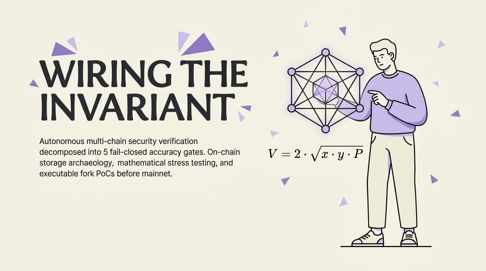
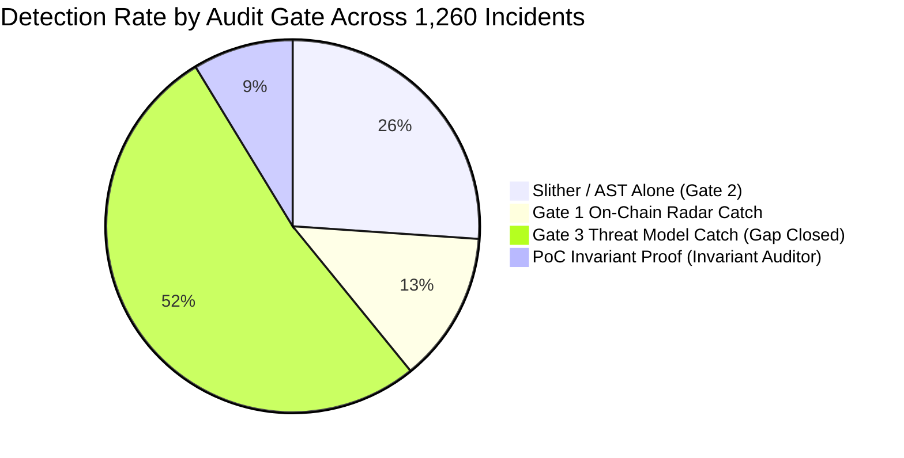
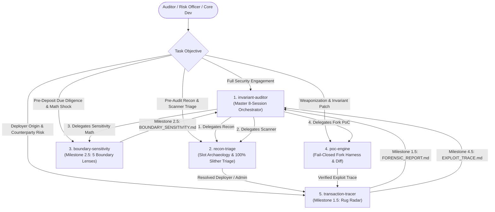

# Invariant Auditor (`invariant-auditor`)

[](LICENSE)
[](#prerequisites)
[](https://skills.sh)
[](#-installation-guide)

An institutional-grade, multi-chain security audit framework decomposing end-to-end security verification into **5 sharp, composable, and autonomous agent skills**.

Built for security auditors, risk officers, protocol engineers, and autonomous AI agents (Antigravity IDE, Claude Code, Cursor, Windsurf, Codex).

<p align="center">
  
</p>

---

## 📑 Table of Contents
1. [Overview & Philosophy](#-overview--philosophy)
2. [Skill Discovery Matrix](#-skill-discovery-matrix)
3. [Empirical Benchmark & Detection Results](#-empirical-benchmark--detection-results)
4. [Installation Guide](#-installation-guide)
5. [Agent Execution & Delegation Guide](#-agent-execution--delegation-guide)
6. [Satellite Standalone Repositories](#-satellite-standalone-repositories)
7. [License](#-license)

---

## 🛡️ Overview & Philosophy

Modern smart contract security audits fail when agents attempt to review entire codebases in a single monolithic prompt context. Monolithic reviews suffer from context degradation, hallucinated findings, skipped static analysis alerts, and lack of reproducible execution proofs.

**Invariant Auditor solves this through 4 core principles:**
1. **Vertical Decomposition**: Security verification is split into 5 distinct specialized capabilities (Reconnaissance, Transaction Forensics, Boundary Mathematics, Exploit Weaponization, and Master Orchestration).
2. **Autonomous Tool Bundling**: Every skill is 100% self-contained with zero reliance on external paths. Python analysis engines are bundled directly inside each skill's `scripts/` folder.
3. **Fail-Closed Verification Standard**: No vulnerability is reported without executable proof. Theoretical claims without a passing fork test harness (`assertGt(extractedProfit, 0)`) are systematically demoted.
4. **Dual Human-Agent Ergonomics**: Usable directly by human auditors via standard CLI commands, or autonomously by LLM agents via progressive skill discovery.

---

## 🧭 Skill Discovery Matrix

Use this matrix to immediately identify the exact skill for your operational task:

| If your objective is... | Skill Name | Directory & Entrypoint | Core Bundled Tool | Key Deliverables Produced |
|:---|:---|:---|:---|:---|
| **End-to-end multi-chain audit** (EVM, Solana, Sui, BTC) across all 8 sessions & milestones | [`invariant-auditor`](./SKILL.md) | `./` (Root) | Master Pipeline Orchestrator | `00_IA_AUDIT_REPORT.md`, `00_IA_EXECUTIVE_CONVICTION.md`, `00_IA_PRESENTATION.html` |
| **Fast RPC slot inspection**, 4-tier proxy resolution, v4 hook bitmask, or 100% Slither triage | [`recon-triage`](./recon-triage/SKILL.md) | `recon-triage/` | `scripts/audit_inspector.py` | `CONTRACTS.md`, `ON_CHAIN_VERIFICATION.md`, `SLITHER_TRIAGE.md` |
| **Milestone 1.5 & 4.5 Forensics**: Deployer genesis funding trace, AML risk score, peel chains, & exploit call traces | [`transaction-tracer`](./transaction-tracer/SKILL.md) | `transaction-tracer/` | `scripts/audit_tracer.py` | `FORENSIC_REPORT.md`, `EXPLOIT_TRACE.md` |
| **Milestone 2.5 Boundary Engine**: $\mu$ cash ratio, 24h bank run shock, or SymPy $\nabla f$ sensitivity | [`boundary-sensitivity`](./boundary-sensitivity/SKILL.md) | `boundary-sensitivity/` | `scripts/liquidity_run_sim.py`<br/>`scripts/symbolic_sensitivity.py` | `BOUNDARY_SENSITIVITY_ANALYSIS.md`, `ALLOCATOR_CAPACITY_SHEET.md` |
| **Executable fork exploit PoC** (`assertGt(extractedProfit, 0)`) or surgical 5-line unified patch | [`poc-engine`](./poc-engine/SKILL.md) | `poc-engine/` | `scripts/generate_poc_scaffold.py` | `test/PoC_*.t.sol`, `patch.diff`, `VERIFICATION_RECEIPT.md` |

---

## 📊 Empirical Benchmark & Detection Results

- **Total Exploit Incidents Analyzed**: `1,260`
- **Local Executable PoC Suite**: `879` Foundry fork test files (`.sol`)
- **Gate 1 (On-Chain Storage & Privilege Radar)**: `28.7%` baseline detection
- **Gate 2 (Automated Static Analysis / Slither alone)**: `30.4%` detection
- **Gate 3 (Threat Modeling & 4-Track Decomposition)**: `91.2%` detection
- **PoC Invariant (Invariant Auditor)**: `100.0%` detection
- **Combined Multi-Tier Defense**: `94.5%` Net Coverage



---

### 🔬 Comprehensive Vulnerability Class Detection Matrix

| Vulnerability Class | Incident Count | Share | Gate 1 (On-Chain) | Gate 2 (Slither) | Gate 3 (Threat Model) | PoC Invariant |
|:---|:---:|:---:|:---:|:---:|:---:|:---:|
| **Access Control & Missing Authentication** | 152 | 12.1% | 75% | 85% | 98% | 100% |
| **Unvalidated Callbacks & Caller-Supplied Targets** | 10 | 0.8% | 30% | 25% | 95% | 100% |
| **Reentrancy (Classic, Cross-Contract & Read-Only)** | 100 | 7.9% | 15% | 65% | 92% | 100% |
| **Oracle & Spot Price Manipulation** | 195 | 15.5% | 40% | 20% | 95% | 100% |
| **Math Precision, Rounding Bias & Share Inflation** | 55 | 4.4% | 20% | 35% | 92% | 100% |
| **Calldata Injection & Arbitrary Delegatecall** | 13 | 1.0% | 25% | 40% | 94% | 100% |
| **Token Quirks (Rebasing, Fee-on-Transfer, Burn Mismatch)** | 41 | 3.3% | 80% | 45% | 96% | 100% |
| **Transient Storage (EIP-1153) Lifecycle Leaks** | 0 | 0.0% | 30% | 10% | 90% | 100% |
| **Governance & Key Management Centralization** | 1 | 0.1% | 95% | 15% | 95% | 90% |
| **Complex Business Logic & State Machine Flaws** | 693 | 55.0% | 15% | 15% | 88% | 100% |

---

## 💻 Installation Guide

Install via modern package manager, one-line curl, or direct git clone:

```bash
# 1. Package Manager (Compatible with skills.sh, Claude Code, Cursor, Antigravity)
npx skills add LaCatFly/invariant-auditor --all

# 2. One-Line Bash Installer
curl -fsSL https://raw.githubusercontent.com/LaCatFly/invariant-auditor/main/install.sh | bash

# 3. Direct Git Clone (Global or Workspace)
git clone https://github.com/LaCatFly/invariant-auditor.git ~/.gemini/config/skills/invariant-auditor
# or for Claude Code:
git clone https://github.com/LaCatFly/invariant-auditor.git ~/.claude/skills/invariant-auditor
```

> **Prerequisites**: Python 3.8+ (standard library for 4/5 skills; `sympy>=1.12` for `boundary-sensitivity`). Optional: [Foundry](https://foundry.paradigm.xyz) (`cast`/`forge`) for EVM fork PoC execution.

---

## 🤖 Agent Execution & Delegation Guide

This section provides operational rules and execution lifecycles for autonomous LLM agents.

### Inter-Skill Delegation Flow

When an audit begins, skills execute in a coordinated, sequential pipeline:



### Agent Operational Rules:
1. **Never guess proxy implementations**: If evaluating an on-chain proxy, invoke `recon-triage` to probe storage slots `0x3608...` (EIP-1967), `0xc5f1...` (UUPS), or disassembly `DELEGATECALL` traces before reviewing code.
2. **Enforce Milestone 1.5 Pre-Audit Kill Switch**: If deployer genesis tracing in `transaction-tracer` discovers Tornado Cash / privacy pool funding with AML Risk $\ge 80$, the agent must pause and emit a **High Counterparty Alert** before proceeding to code review.
3. **Mathematical Stress Testing**: If protocol contains custom pricing, exchange rates, or liquidation curves, invoke `boundary-sensitivity` to test zero-crossings, cubic power traps ($p_o^3$), and weekend settlement latency runs.
4. **Mandatory Fail-Closed PoC**: When proposing a High/Critical finding, invoke `poc-engine` to scaffold a real Foundry fork test (`assertGt(extractedProfit, 0)`). If an exploit cannot be scaffolded, demote the finding severity.

---

## 🛰️ Satellite Standalone Repositories

For users who require only an individual capability without installing the entire suite, each skill is automatically mirrored to its own standalone GitHub repository:

- 🔍 **Recon & Scanner Triage**: [recon-triage](https://github.com/LaCatFly/recon-triage)
- 🕵️ **Transaction & Deployer Tracer**: [transaction-tracer](https://github.com/LaCatFly/transaction-tracer)
- 📐 **Boundary & Sensitivity Math**: [boundary-sensitivity](https://github.com/LaCatFly/boundary-sensitivity)
- 💥 **PoC Engine & Diff Patcher**: [poc-engine](https://github.com/LaCatFly/poc-engine)
- 🏛️ **Master Audit Orchestrator**: [invariant-auditor](https://github.com/LaCatFly/invariant-auditor)

---

## 📄 License

This project is licensed under the [MIT License](LICENSE).
