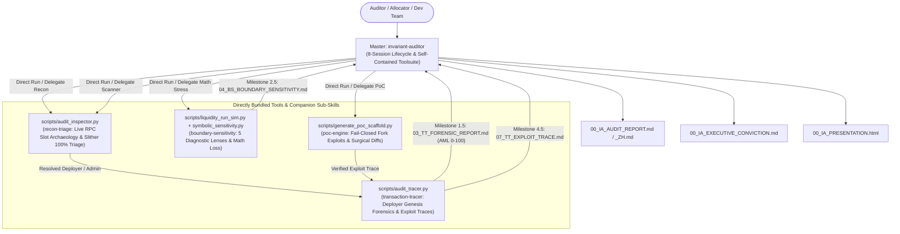

<!-- argument-hint: [protocol name, contract address, chain, or audit directory] -->

# Institutional Multi-Chain Security Audit Engine (`invariant-auditor`)

**Standard**: 8-Session Master Lifecycle | Formal Invariant & Verification Architecture | Cryptographic Asset & Genesis Flow Standard | CVSS 3.1 Web3 Calibrated  
**Target Scope**: EVM (Solidity/Vyper), Solana (Anchor/Rust), Sui (Move), and Bespoke / Unknown Architectures via Pure State-Mutation Topology.

---

## 🧭 Technical Architecture & Dual Execution Topology

`invariant-auditor` operates in two complementary execution modes:
1. **Self-Contained Master Flagship (Default for Claude Code / Single Agent)**: Bundles all 5 executable audit tools in `scripts/`. Executes every phase directly in sequence with zero missing dependency gaps.
2. **Modular Satellite Orchestrator (Multi-Agent / Subagent Mode)**: Coordinates 4 specialized companion sub-skills (`recon-triage`, `transaction-tracer`, `boundary-sensitivity`, `poc-engine`) across distributed agents.



---

## 📐 The Protocol Abstract Interface (PAI): Universal Invariant Foundation

To prevent overfitting to standard EVM templates, the audit engine models every target codebase as a **Thermodynamic Value Reservoir governed by 4 Universal Dimensions**:

1. **The Reservoir (State)**: Storage slots (`SLOAD`/`SSTORE`), Solana AccountInfo/PDAs, Sui Object dynamic fields, or raw memory offsets.
2. **Inflow Valve**: Public entrypoints accepting external assets and issuing internal claims (`deposit()`, `mint()`, `supply()`).
3. **Outflow Valve**: Public entrypoints burning internal claims and returning external assets (`withdraw()`, `redeem()`, `borrow()`).
4. **Valuation Oracle**: The mathematical function mapping internal claims to external collateral ($Q_{\text{shares}} \leftrightarrow Q_{\text{assets}}$).

### The 3 Core Conservation Invariants
Every protocol is tested against three non-negotiable invariants:
- **Invariant 1: Solvency Conservation**: $\sum \text{ExternalAssetsInContract} \ge \sum \text{UserClaims} \times \text{ValuationOracle}()$
- **Invariant 2: Monotonicity of Claims**: $\frac{\partial (\text{AssetPerShare})}{\partial t} \ge 0$ (absent legitimate protocol negative yield / fees).
- **Invariant 3: Exit Symmetry (The Roach Motel Test)**: Normal users must always be able to withdraw within latency $\tau_{\max}$ whenever inflows are enabled.

---

## 📥 Ingestion Interfaces: Master Input Block & Zero-Config Fallback

### Mode A: Master Input Block (Full Precision Ingestion)
```markdown
# Smart Contract Security Audit Request
- **Protocol Name**: {PROTOCOL_NAME}
- **Target Network**: {CHAIN_NAME} (Chain ID: {CHAIN_ID})
- **Primary RPC Endpoint**: {RPC_URL}
- **Source Code Origin**: {LOCAL_DIR | GITHUB_REPO_URL | ETHERSCAN_VERIFIED}
- **Solidity / Framework**: {COMPILER_VERSION} (e.g., 0.8.24, Foundry, Anchor, Move)
- **Estimated Protocol TVL / Liabilities**: ${TVL_USD}
- **Target Archetype**: [Auto-Detect | AMM | Uniswap v4 Hook | Lending/CDP | ERC-4626 Vault | RWA | Bespoke]
- **Deployed Addresses**: Track A (Core Vault), Track B (Accounting/Hook), Track C (Oracle), Track D (Gov)
```

### Mode B: Zero-Config Fallback (Single Address / CLI)
When given only an address or directory (e.g. `/audit 0x123... on Base`):
1. Query bytecode with `cast code <address> --rpc-url <RPC>`.
2. Execute the 4-tier proxy resolution to resolve the implementation address and owner.
3. Fetch verified source code and ABI from explorer APIs.
4. Auto-classify archetype via bytecode signatures (e.g. Uniswap v4 hook bitmask, ERC-4626 selectors).
5. Prompt the user via `ask_question` only for missing critical credentials.

---

## 🧠 The 8 Master Sessions & Core Forensic Milestones

```mermaid
graph LR
    S1["S1: Ingestion"] --> S2["S2: On-Chain Recon"]
    S2 --> M15["🏁 M1.5: Deployer Forensics"]
    M15 --> S3["S3: 100% Scanner Triage"]
    S3 --> M25["🏁 M2.5: Boundary Math Engine"]
    M25 --> S5["S5: 5 Attacker Personas"]
    S5 --> S6["S6: Fail-Closed PoC"]
    S6 --> M45["🏁 M4.5: Exploit Call Trace"]
    M45 --> S7["S7: Surgical Patch"]
    S7 --> S8["S8: Tri-Perspective Delivery"]
```



### Session 1: Input Ingestion & Archetype Routing
- Validate RPC responsiveness, normalize checksums, and partition contracts into functional tracks (A: Core, B: Accounting, C: Oracle, D: Governance).
- If standard templates fail to match, switch immediately to the **Unknown / Bespoke State-Mutation Pipeline**.
- *Deliverable*: `WORKSPACE.md` initialized.

### Session 2: On-Chain Storage Slot Archaeology (Live RPC)
- **Execution**: Run bundled `scripts/audit_inspector.py` (or companion sub-skill `recon-triage`):
  ```bash
  python3 scripts/audit_inspector.py --rpc $RPC_URL --address <TARGET_ADDRESS>
  ```
- Probe functional getters, compute semantic slot namespaces, and trace runtime bytecode `DELEGATECALL`/`SLOAD` opcodes.
- Verify Uniswap v4 hook bitmasks (14 flags) and timelock delays.
- *Deliverables*: `01_RT_CONTRACTS.md`, `02_RT_PROTOCOL_DECOMPOSITION.md`, `01_RT_ON_CHAIN_VERIFICATION.md`.

### 🏁 Milestone 1.5: Deployer Genesis & Counterparty Forensics (The Rug Radar)
- **Execution**: Run bundled `scripts/audit_tracer.py` (or companion sub-skill `transaction-tracer`):
  ```bash
  python3 scripts/audit_tracer.py <TARGET_CONTRACT_OR_DEPLOYER> --chain <CHAIN> --output output/<PROTOCOL>/03_TT_FORENSIC_REPORT.md
  ```
- Resolves deployer EOA, executes 5-step genesis funding heuristic, traces first native gas inflows, identifies CEX vs. Privacy Pool vs. Bridge origin, runs 3-hop address clustering, and calculates AML Risk Score (0–100).
- *Deliverable*: `03_TT_FORENSIC_REPORT.md` (AML Risk Score 0–100). Must also be embedded into `00_IA_AUDIT_REPORT.md` Section 1.3 and `00_IA_PRESENTATION.html`.
- > [!CAUTION]
  > **Pre-Audit Kill Switch**: If AML Risk $\ge 80$ (e.g. Privacy mixer genesis gas $<72\text{h}$ prior to deployment), inject an immediate Critical Malicious Team warning in `WORKSPACE.md`. Allocators can halt before expending further audit budget.

### Session 3: Automated Scanner 100% Triage & Assumptions Matrix
- **Execution**: Run Slither / Aderyn / Move analyzer, parse JSON via `jq` (or companion sub-skill `recon-triage`):
  ```bash
  slither . --json slither.json
  cat slither.json | jq '.results.detectors[] | select(.impact == "High" or .impact == "Medium")' > triage.json
  ```
- Triage 100% of High and Medium findings.
- Classify as `Confirmed` (with causal attack vector) or `False Positive` (citing exact lines satisfying Checks-Effects-Interactions, reentrancy guards, or balance checks).
- **Mandatory `02_RT_AUDIT_PLAN.md` Standard**:
  1. *Scope & In-Scope Inventory*: Partitioned into functional tracks with concrete `Slither Targets` (exact high-risk functions and critical entrypoints).
  2. *Trail of Bits Assumptions vs. Guarantees Matrix*: Standardized ASCII matrix contrasting what code assumes is true vs. live blockchain/bytecode reality, followed by numbered explanations of broken invariants.
  3. *Prior Audit Cross-Reference & Lineage*: Mapping upstream codebase heritage (e.g. Uniswap v4, OpenZeppelin, Alphix) and verified vs. novel attack surface.
- *Deliverables*: `02_RT_SLITHER_TRIAGE.md`, `02_RT_AUDIT_PLAN.md`.

### 🏁 Milestone 2.5: Deep Boundary & Sensitivity Engine (The 5 Diagnostic Lenses)
- **Execution**: Run bundled economic math tools (or companion sub-skill `boundary-sensitivity`):
  ```bash
  # Lens 1: Bank run shock simulation (24h/48h weekend lag)
  python3 scripts/liquidity_run_sim.py --liabilities <LIABILITIES> --cash <INSTANT_CASH> --shock 0.25 --hours 48

  # Lens 3: Closed-form symbolic Jacobian & zero-crossing denominator check
  python3 scripts/symbolic_sensitivity.py --formula "<FORMULA>" --vars <VARS...>
  ```
- Execute the **5 Boundary Diagnostic Lenses**:
  1. *Cashflow Slicing*: Instant cash ratio $\mu = \frac{C_{\text{instant}}}{\text{Liabilities}}$ and 24h 25% run shock simulation over weekend latency.
  2. *Extreme State Preconditioning*: Elasticity and share pricing under 90% liquidity drains.
  3. *Closed-Form Sensitivity*: SymPy Jacobian $\frac{\partial \text{Metric}}{\partial P}$ to uncover cubic/higher-power anomalies and zero-crossing denominators.
  4. *Limiter Friction*: Rate limiter throughput vs. MEV drain velocity.
  5. *Sovereign Seams*: Legal privity and off-chain custodial solvency.
- *Deliverables*: `04_BS_BOUNDARY_SENSITIVITY.md`, `04_BS_ALLOCATOR_CAPACITY.md`.

### Session 5: 5 Attacker Personas Threat Modeling
- Analyze target functions against 5 distinct adversarial personas (informed by `03_TT_FORENSIC_REPORT.md`):
  1. **MEV Searcher**: Frontrunning, sandwiching, backrunning, and atomic arbitrage.
  2. **Malicious LP**: Tick manipulation, share dilution, first-deposit inflation, and donation attacks.
  3. **Rogue Admin / Compromised Key**: Blast radius of instant pause, balance wipe (`adminBurn`), or parameter manipulation.
  4. **Composability Manipulator**: Cross-protocol atomic flash-loan loops, collateral recycling, and read-only reentrancy.
  5. **Weekend Arbitrageur**: Off-market macro gap arbitrage across weekend market closures vs. lagging oracles.
- *Deliverables*: `05_IA_THREAT_MODEL.md`, `05_IA_DIAGRAMS.md`.

### Session 6: Fail-Closed Fork PoC Verification (IRON RULE)
- **Execution**: Run bundled PoC scaffolder and test runner (or companion sub-skill `poc-engine`):
  ```bash
  python3 scripts/generate_poc_scaffold.py --protocol <PROTOCOL> --rpc $RPC_URL --target <ADDRESS>
  forge test --match-contract PoC -vvv
  ```
- **Rule**: Findings without executable balance extraction receipts CANNOT be classified as Critical or High.
- Auto-generate test scaffold against pinned fork blocks into `output/<PROTOCOL>/test/`.
- Run `forge test --match-contract PoC -vvv` asserting `assertGt(extractedProfit, 0)`.
- *Deliverable*: `output/<PROTOCOL>/test/06_PE_PoC_<PROTOCOL>.t.sol` (or Move/Anchor test scenario).

### 🏁 Milestone 4.5: Adversarial Exploit Flow & Internal Trace Reconstruction
- **Execution**: Run trace parser on verified execution logs from Session 6 (or companion sub-skill `transaction-tracer`):
  ```bash
  python3 scripts/audit_tracer.py <TX_HASH_OR_ADDRESS> --chain <CHAIN> --output output/<PROTOCOL>/07_TT_EXPLOIT_TRACE.md
  ```
- Ingest verified execution logs and call traces from Session 6.
- Decode transaction calldata, parse internal token `Transfer` event logs, map multi-hop DEX/bridge routes, and identify peel chain or mixer deposit patterns.
- *Deliverable*: `07_TT_EXPLOIT_TRACE.md`.

### Session 7: Surgical Remediation Diff & Invariant Restoration
- **Execution**: Write and verify minimal surgical unified diffs (5 to 15 lines) that restore the broken invariant (or companion sub-skill `poc-engine`):
  ```bash
  git apply 08_PE_patch.diff
  forge test --match-contract PoC -vvv  # Must revert or fail exploit assertion
  forge test                           # All base test suite must pass
  ```
- *Deliverables*: `08_PE_patch.diff`, `08_PE_VERIFICATION_RECEIPT.md`.

### Session 8: Tri-Perspective Institutional Delivery & HTML Visual Presentation
- Avoid consulting fluff and deliver 4 specialized stakeholder documents into `output/<PROTOCOL>/`:
  1. **Tools & Verification Engine Manifest** (`00_IA_MANIFEST.json`): Explicit machine-readable table of tools, scripts, RPC endpoints, git commits, and hashes.
  2. **Perspective A (Core Developer)**: `00_IA_AUDIT_REPORT.md` / `_ZH.md` (MUST preserve and elevate Section 1: In-Scope Inventory with Slither Targets, Section 2: Trail of Bits Assumptions vs. Guarantees Matrix, and Section 3: Prior Audit Cross-Reference & Lineage, followed by Standard Finding Cards, CVSS 3.1 Web3 vector, AST line citations, and surgical unified diffs).
  3. **Perspective B (Allocator / Risk Lead)**: `00_IA_EXECUTIVE_CONVICTION.md` (1-page verdict, AML score, physical cash ratio $\mu$, **Top 3 Critical Weaknesses & Operational Traps**, max capacity $C_0$).
  4. **Perspective C (Adversarial Operator)**: `07_TT_EXPLOIT_TRACE.md` (Detailed step-by-step transaction call traces with gas and extraction receipts).
  5. **Interactive Executive Presentation**: `00_IA_PRESENTATION.html` (Standalone, aesthetic, dark-mode visual interactive report featuring risk badges, architecture diagrams, weakness radars, and clickable contract links).

---

## 📋 The Standard Deliverables Checklist (`output/<protocol-slug>/`)

All deliverables are deposited under `output/<protocol-slug>/` using deterministic skill prefixes:
- `IA`  = `invariant-auditor` (Master Security Audit Engine)
- `RT`  = `recon-triage`
- `TT`  = `transaction-tracer`
- `BS`  = `boundary-sensitivity`
- `PE`  = `poc-engine`

| # | Standardized Filename | Producing Skill | Purpose & Content |
|---|:---|:---:|:---|
| 0 | `00_IA_MANIFEST.json` | Master (`invariant-auditor`) | Cryptographic receipt of all artifacts, git commits, tool invocations. |
| 1 | `01_RT_CONTRACTS.md` | `recon-triage` | Complete contract bytecode inventory, roles, and proxy targets. |
| 2 | `02_RT_PROTOCOL_DECOMPOSITION.md` | `recon-triage` | Functional partitioning into Tracks A, B, C, D. |
| 3 | `01_RT_ON_CHAIN_VERIFICATION.md` | `recon-triage` | Live RPC storage slot receipts, timelock delays, hook bitmasks. |
| 4 | `03_TT_FORENSIC_REPORT.md` | `transaction-tracer` (M1.5) | Deployer genesis gas origin, AML score (0-100), 3-hop cluster map. |
| 5 | `02_RT_SLITHER_TRIAGE.md` | `recon-triage` | 100% triage of automated scanner warnings with line proofs. |
| 6 | `02_RT_AUDIT_PLAN.md` | Master / `recon-triage` | Assumptions vs. Guarantees Matrix. |
| 7 | `04_BS_BOUNDARY_SENSITIVITY.md` | `boundary-sensitivity` (M2.5) | 5 Boundary Diagnostic Lenses, $\mu$ cash ratio, 24h shock, SymPy $\nabla f$. |
| 8 | `04_BS_ALLOCATOR_CAPACITY.md` | `boundary-sensitivity` | Settlement latency, bank run shock profile, max capacity $C_0$. |
| 9 | `05_IA_THREAT_MODEL.md` | Master (`invariant-auditor`) | 5 Attacker Personas, Mermaid call trees, state mutations. |
| 10| `06_PE_PoC_<PROTOCOL>.t.sol` | `poc-engine` | Reproducible fork exploit test asserting `extractedProfit > 0`. |
| 11| `07_TT_EXPLOIT_TRACE.md` | `transaction-tracer` (M4.5) | Calldata decoding, internal token hops, peel chains, mixer exits. |
| 12| `08_PE_patch.diff` & `08_PE_VERIFICATION_RECEIPT.md` | `poc-engine` | Surgical 5–15 line diff blocking exploit with zero regressions. |
| 13| `00_IA_AUDIT_REPORT.md` & `00_IA_EXECUTIVE_CONVICTION.md` | Master (`invariant-auditor`) | Institutional developer report and 1-page Allocator decision card. |
| 14| `00_IA_PRESENTATION.html` | Master (`invariant-auditor`) | Interactive standalone HTML executive dashboard with visual risk metrics. |

---

## 📚 Core Domain References

- **Multi-Chain Archetypes (`references/chains/`)**: [`evm.md`](./references/chains/evm.md), [`solana.md`](./references/chains/solana.md), [`sui.md`](./references/chains/sui.md), [`btc.md`](./references/chains/btc.md)
- **Perspective B (Allocator & Capital Risk)**: [`allocator-perspective.md`](./references/perspectives/allocator-perspective.md) (4 investor archetypes, 5 pre-allocation gates, 5 kill-switches, Anvil dry-run)
- **Audit Heuristics & Verification Gaps**: [`audit-heuristics.md`](./references/perspectives/audit-heuristics.md) (View-function blindspot, CEI sequencing, 5 rapid gap identification heuristics)

---

## 🛠️ Direct Script Execution Reference

All 5 core tools are bundled directly in `scripts/` for self-contained single-agent and Claude Code execution:

```bash
# 1. On-Chain Recon (Slot Archaeology, EIP-1967/UUPS Proxy Resolution & Hook Bitmask)
python3 scripts/audit_inspector.py --rpc $RPC_URL --address <ADDRESS>

# 2. Deployer Genesis Forensics (Milestone 1.5 - Rug Radar)
python3 scripts/audit_tracer.py <TARGET_CONTRACT_OR_DEPLOYER> --chain <CHAIN> --output output/<PROTOCOL>/03_TT_FORENSIC_REPORT.md

# 3. Static Analysis 100% Triage
slither . --json slither.json
cat slither.json | jq '.results.detectors[] | select(.impact == "High" or .impact == "Medium")' > triage.json

# 4. Liquidity Shock & Bank Run Simulation (Milestone 2.5 Lens 1)
python3 scripts/liquidity_run_sim.py \
  --liabilities 50000000 --cash 5000000 --shock 0.25 --hours 48

# 5. Closed-Form Symbolic Calculus (Milestone 2.5 Lens 3)
python3 scripts/symbolic_sensitivity.py \
  --formula "(collateral * p_o) / (debt * (1 - penalty))" --vars p_o debt

# 6. Instant Foundry PoC Harness Generation
python3 scripts/generate_poc_scaffold.py \
  --protocol <PROTOCOL> --rpc $RPC_URL --target <ADDRESS>
```

> [!NOTE]
> When executing individual satellite sub-skills independently, these scripts are also identically accessible via `<sub-skill>/scripts/<tool>.py`.
