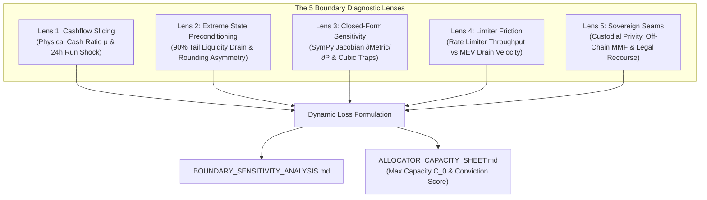

<!-- argument-hint: [protocol name, accounting formula, reserve numbers, or contract address] -->

# Deep Boundary & Sensitivity Engine (`boundary-sensitivity`)

**Standard**: Dynamic Boundary Methodology | Thermodynamic Economic Invariants | SymPy Algebraic Calculus  
**Role in Suite**: Executes **Session 5: Deep Boundary & Sensitivity Math Engine** in [`invariant-auditor`](../README.md).  
**Target Audience**: DeFi Risk Officers, Institutional Allocators, Quantitative Auditors, and Core Protocol Engineers.

---

## 🧭 The Physics of Decentralized Value & Boundary Stress Testing

Traditional smart contract audits only inspect static syntax. **They are blind to economic insolvency and liquidity run dynamics.** Session 5 models smart contracts as physical dynamical systems subjected to adversarial pressure:



---

## 🔬 The 5 Diagnostic Lenses in Detail

### Lens 1: Cashflow Slicing & Settlement Latency Shock
- **Core Metric**: Physical Instant Cash Ratio:
  $$\mu = \frac{C_{\text{instant}}}{\text{Total Liabilities}}$$
- **The Failure Mode**: A protocol claims $100M TVL and 100% solvency, but only $5M is held in instant in-contract liquid tokens ($C_{\text{instant}}$). The remaining $95M is committed to a 14-day unbonding queue or an off-chain T-Bill provider.
- **The Simulation**: Run a 24-hour 25% panic bank run shock over weekend market closure ($T_{\text{weekend}} = 60\text{ hours}$):
  $$\text{Outflow}(t) = \text{Total Liabilities} \times (1 - e^{-\kappa t})$$
- If $\text{Outflow}(t) > C_{\text{instant}}(t)$ before settlement latency finishes, the protocol freezes or suffers bad debt.

### Lens 2: Extreme State Preconditioning (Tail State Elasticity)
- **The Principle**: Vulnerabilities rarely trigger at steady-state equilibrium $E_0$. Attackers weaponize flash loans to push protocol state to 90–99% depletion.
- **Boundary Checks**:
  1. **Near-Zero Share Elasticity**: When `totalSupply -> 0`, does `assetPerShare` truncate or round to zero?
  2. **First Deposit / Inflation Vector**: If an attacker deposits 1 wei and donates $\$10,000$, do subsequent user deposits suffer $> 10\%$ rounding loss?
  3. **High-Utilization Kink Singularity**: When borrow utilization approaches $100\%$, does the interest rate jump exponentially, making liquidation unexecutable due to gas limits?

### Lens 3: Closed-Form Non-Linear Sensitivity ($\nabla f$ & Jacobians)
- **The Principle**: Deconstruct contract accounting formulas into symbolic equations using SymPy to compute the first and second partial derivatives:
  $$\text{Jacobian: } J_i = \frac{\partial \text{Metric}}{\partial P_i}, \quad \text{Hessian: } H_{ij} = \frac{\partial^2 \text{Metric}}{\partial P_i \partial P_j}$$
- **Vulnerability Signatures Flagged**:
  1. **Cubic or Higher-Order Sensitivity ($P^3$)**: Small external price manipulation creates non-linear extraction rewards for arbitrageurs.
  2. **Zero-Crossing Denominators**: Expressions like $\frac{A \cdot B}{C - D}$ where an adversary can cause $C \approx D$, resulting in infinite share issuance or integer overflow reverts.
  3. **Inverse Monotonicity**: Scenarios where collateral price increases, yet the account Health Factor paradoxically decreases ($\frac{\partial \text{Health}}{\partial P} < 0$).

### Lens 4: Limiter Friction & Drainage Latency
- **The Metric**: Drainage Velocity vs. Rate Limiter Replenishment:
  $$v_{\text{drain}} = \frac{\Delta \text{Assets}}{\Delta t_{\text{block}}} \quad \text{vs.} \quad R_{\text{limit}} = \frac{\text{Quota}}{\text{Epoch}}$$
- **Checks**:
  - Can an attacker exhaust the rate limiter across multiple epochs using flash-borrowed bot swarms?
  - Are withdrawal rate limits applied per-account or globally? (Per-account limits are easily bypassed with Sybil addresses).

### Lens 5: Sovereign Seams & Custodial Privity
- **Target**: RWA, synthetic tokens, liquid restaking tokens (LRT), and hybrid CeFi/DeFi systems.
- **Checks**:
  - **Legal Privity**: Does the on-chain token holder possess a direct legal claim against the custodial bankruptcy estate, or only against an opaque offshore SPV?
  - **Weekend Market Mismatch**: Traditional equities (SPY/QQQ) and bond markets close on Friday 4 PM EST and reopen Monday 9:30 AM EST. On-chain AMMs trading synthetic equivalents without dynamic weekend fee widening bleed 100% of macro gap risk to MEV bots on Monday morning.

---

## 🛠️ Automated Execution & CLI Workflows

### 1. Running the Liquidity Run & Latency Simulator (Lens 1)
```bash
python3 scripts/liquidity_run_sim.py \
  --liabilities 50000000 \
  --cash 5000000 \
  --shock 0.25 \
  --delayed-t1 10000000 \
  --delayed-t2 35000000 \
  --hours 72 \
  --weekend
```
*Output*: Computes physical cash ratio $\mu$, exact hour of illiquidity exhaustion ($T_{\text{exhaust}}$), and maximum sustainable withdrawal capacity.

### 2. Running Symbolic Sensitivity Analysis (Lens 3)
```bash
python3 scripts/symbolic_sensitivity.py \
  --formula "collateral_val / (debt_val + 1e-18)" \
  --vars collateral_val debt_val
```
*Output*: Generates simplified derivative equations, detects denominator singularities, and flags non-linear amplification traps.

---

## 📋 Standard Output Artifacts

Every execution of this skill produces two decisive documents:

### 1. `BOUNDARY_SENSITIVITY_ANALYSIS.md`
- Complete diagnostic scorecard across all 5 Lenses.
- Mathematical graphs and SymPy derivative tables.
- Extreme state simulation logs (0%, 50%, 90% liquidity levels).

### 2. `ALLOCATOR_CAPACITY_SHEET.md`
- **1-Page Conviction Summary**: Clear deployment verdict (`APPROVED`, `APPROVED WITH RESTRICTIONS`, `REJECTED`).
- **Physical Cash Ratio ($\mu$)**: Instant liquidity vs paper solvency.
- **Max Deposit Capacity ($C_0$)**: The exact maximum dollar amount that can be deployed before withdrawal slippage exceeds $2\%$.
- **The 3 Unwritten Truths**: Concise, plain-English operational realities the team won't advertise on Twitter.
