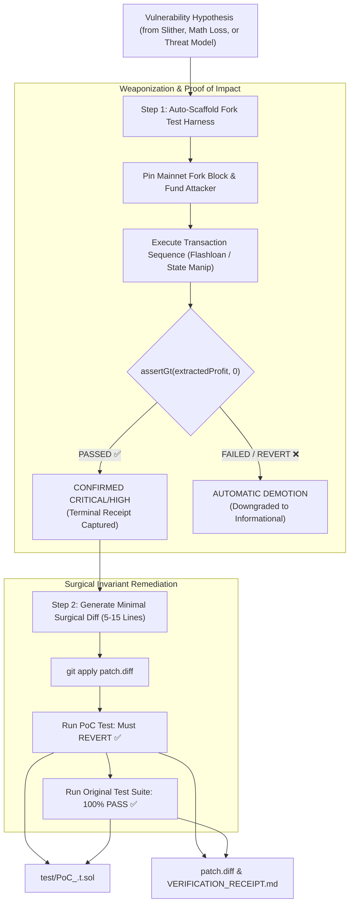

<!-- argument-hint: [protocol name, target contract address, RPC URL, or vulnerability description] -->

# Fail-Closed PoC & Surgical Remediation Engine (`poc-engine`)

**Standard**: Fail-Closed Proof Standard | Executable Fork Verification | Non-Destructive Invariant Restoration  
**Iron Rule**: **Unproven Findings = Noise, Not Vulnerabilities.** An auditor or agent CANNOT classify a finding as Critical or High without an executable, passing test proving state corruption or balance extraction (`assertGt(extractedProfit, 0)`).

---

## 🧭 Visual Operational Workflow



---

## ⚡ Step 1: Instant Fork Scaffolding (`generate_poc_scaffold.py`)

Eliminate 90% of manual setup friction by running the automated scaffolding utility:

```bash
python3 scripts/generate_poc_scaffold.py \
  --protocol <PROTOCOL_NAME> \
  --rpc $RPC_URL \
  --target <TARGET_ADDRESS> \
  --solc 0.8.24
```

This generates:
1. `foundry.toml` pre-configured with pinned RPC endpoints, optimizer settings, and shared library paths.
2. `test/PoC_<PROTOCOL_NAME>.t.sol` ready to run against live state.

---

## 🎯 Step 2: Canonical PoC Exploit Structure (Foundry EVM)

```solidity
// SPDX-License-Identifier: MIT
pragma solidity 0.8.24;

import "forge-std/Test.sol";

interface IERC20 {
    function balanceOf(address account) external view returns (uint256);
    function transfer(address to, uint256 amount) external returns (bool);
}

contract PoC_Exploit is Test {
    address constant TARGET = 0x...; // Victim contract
    address constant ASSET = 0x...;  // Underlying token
    address constant ATTACKER = address(0xBEEF);
    
    uint256 mainnetFork;

    function setUp() public {
        // Pin to live mainnet state at block of interest
        mainnetFork = vm.createFork(vm.envString("RPC_URL"));
        vm.selectFork(mainnetFork);
        
        vm.deal(ATTACKER, 10 ether);
    }

    function test_exploit_extraction() public {
        vm.startPrank(ATTACKER);
        
        uint256 balanceBefore = IERC20(ASSET).balanceOf(ATTACKER);
        
        // 1. Attack Setup (e.g. Flashloan or state manipulation)
        // ... execute vulnerable calls ...

        // 2. State Extraction
        // ... siphon funds from TARGET ...

        uint256 balanceAfter = IERC20(ASSET).balanceOf(ATTACKER);
        uint256 extractedProfit = balanceAfter - balanceBefore;

        console.log("=== EXPLOIT RECEIPT ===");
        console.log("Extracted Profit (Wei):", extractedProfit);

        // FAIL-CLOSED ASSERTION: Must prove positive balance extraction
        assertGt(extractedProfit, 0, "Exploit failed to extract value!");
        
        vm.stopPrank();
    }
}
```

### Running the Fork Test:
```bash
forge test --match-contract PoC_Exploit -vvv
```

---

## 🦀 Multi-Chain PoC Execution Patterns

### Solana (Anchor Bankrun / Localnet)
```typescript
import { startAnchor } from "solana-bankrun";
import { PublicKey } from "@solana/web3.js";
import { assert } from "chai";

it("Proves balance drainage via missing signer or PDA confusion", async () => {
  const context = await startAnchor(".", [], []);
  const provider = context.provider;
  
  const balanceBefore = await context.banksClient.getBalance(attacker.publicKey);
  
  // Execute rogue instruction
  await program.methods.vulnerableWithdraw().accounts({ ... }).signers([attacker]).rpc();

  const balanceAfter = await context.banksClient.getBalance(attacker.publicKey);
  assert.isTrue(balanceAfter > balanceBefore, "Solana exploit failed to drain lamports");
});
```

### Sui (Move `test_scenario`)
```move
#[test]
fun test_linear_asset_hijack() {
    let mut scenario = test_scenario::begin(@0xBEEF);
    {
        // 1. Trigger vulnerable entrypoint
        vulnerable_module::drain_escrow(&mut escrow, test_scenario::ctx(&mut scenario));
    };
    test_scenario::next_tx(&mut scenario, @0xBEEF);
    {
        // 2. Assert attacker received coin
        let coin = test_scenario::take_from_sender<Coin<SUI>>(&scenario);
        assert!(coin::value(&coin) > 0, 0);
        test_scenario::return_to_sender(&scenario, coin);
    };
    test_scenario::end(scenario);
}
```

---

## 🩹 Step 3: Surgical Remediation Diff (`patch.diff`)

Once the exploit is proven, write a **minimal surgical patch** (5 to 15 lines) that restores the invariant without altering business logic or inflating gas costs unnecessarily:

```diff
--- a/src/CoreVault.sol
+++ b/src/CoreVault.sol
@@ -142,6 +142,8 @@ contract CoreVault is ReentrancyGuard {
         uint256 shares = previewDeposit(assets);
+        require(shares > 0, "Zero shares minted");
+        require(totalAssets() + assets <= MAX_CAPACITY, "Capacity exceeded");
         
         _transferAssets(msg.sender, address(this), assets);
         _mint(receiver, shares);
```

### The 2-Way Patch Verification Protocol:
Execute the verification sequence to generate `VERIFICATION_RECEIPT.md`:

```bash
# 1. Apply the patch
git apply patch.diff

# 2. Re-run PoC: Must REVERT (Exploit blocked)
forge test --match-contract PoC_Exploit -vvv && (echo "FAIL: Exploit still works!" && exit 1) || echo "SUCCESS: Exploit blocked!"

# 3. Re-run complete project test suite: Must PASS 100% (Zero regression)
forge test

# 4. Generate verification receipt
echo "## Verification Receipt" > VERIFICATION_RECEIPT.md
echo "1. Exploit Blocked: Revert confirmed." >> VERIFICATION_RECEIPT.md
echo "2. Regression Tests: 100% Passing." >> VERIFICATION_RECEIPT.md
```

---

## 📋 Standard Deliverables Produced

1. `test/PoC_<PROTOCOL>.t.sol` (or cross-chain test script): Executable proof of impact.
2. `patch.diff`: Minimal unified diff fixing the root cause.
3. `VERIFICATION_RECEIPT.md`: Terminal logs proving the exploit is blocked and regression suite passes.

---

## 🔄 Suite Handoff: Triggering Milestone 4.5 Exploit Call Trace

Once the PoC exploit passes and captures fund extraction receipts, pass the execution trace and transaction calldata to [`transaction-tracer`](../transaction-tracer/SKILL.md) to execute **Milestone 4.5: Adversarial Exploit Flow & Internal Trace Reconstruction**:
- Decodes internal `Transfer(address,address,uint256)` event logs.
- Identifies multi-hop routing, flash loan repayment paths, and mixer exit addresses.
- Compiles the final institutional [`EXPLOIT_TRACE.md`](../SKILL.md#session-8-tri-perspective-institutional-delivery) for Perspective C (Adversary).

