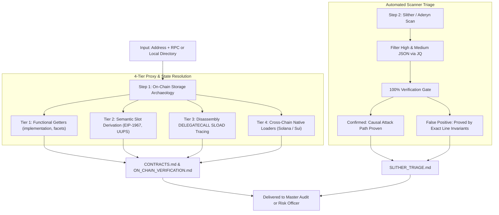

<!-- argument-hint: [contract address, RPC URL, chain name, or source directory] -->

# Fast On-Chain Recon & Scanner Triage Engine (`audit-recon-triage`)

**Standard**: Institutional On-Chain Discovery | EIP-1967/UUPS/Diamond Dynamic Probing | 100% Slither Zero-Dismissal Standard  
**Purpose**: Rapidly verify live deployed bytecode, resolve proxies without relying on marketing claims, validate administrative timelocks, and triage 100% of automated static analysis findings into confirmed attack paths or proven false positives.

---

## 🧭 Visual Operational Workflow



---

## 🔍 Step 1: The 4-Tier Dynamic Proxy & State Discovery Protocol

### Runtime Detection Flow

Check available CLI tools before execution:

```bash
# Slither availability
command -v slither >/dev/null 2>&1 && HAS_SLITHER=yes || HAS_SLITHER=no

# Cast availability (Foundry)
command -v cast >/dev/null 2>&1 && HAS_CAST=yes || HAS_CAST=no

# Python availability for inspector
command -v python3 >/dev/null 2>&1 && HAS_PYTHON=yes || HAS_PYTHON=no
```

**Decision tree**:
- If `HAS_SLITHER=yes` → Run Slither triage (Step 3)
- If `HAS_SLITHER=no` but `HAS_PYTHON=yes` → Run manual inspector
- If neither → Abort with: "Install Slither or ensure python3 is available"

Defaults table:

| Parameter | Default | When Applied |
|---|---|---|
| `--rpc-url` | prompts user | Required for all tiers |
| `--address` | prompts user | Required for all tiers |
| `--output` | `./recon_output.json` | Step 1 auto-detection |
| `--slither` | auto | Use if `command -v slither` succeeds |
| `--cast` | auto | Use if `command -v cast` succeeds |
Attempt dynamic view calls across standard accessor patterns:
```bash
cast call <ADDRESS> "implementation()(address)" --rpc-url $RPC_URL
cast call <ADDRESS> "getImplementation()(address)" --rpc-url $RPC_URL
cast call <ADDRESS> "masterCopy()(address)" --rpc-url $RPC_URL
cast call <ADDRESS> "facets()((address,bytes4[])[])" --rpc-url $RPC_URL
cast call <ADDRESS> "target()(address)" --rpc-url $RPC_URL
```

### Tier 2: Semantic Namespace Slot Derivation
Compute storage slots dynamically from standardized namespaces rather than hardcoded hex:
$$\text{Slot} = \text{keccak256}(\text{namespace}) - \text{offset}$$
Inspect canonical slots:
```bash
# EIP-1967 Implementation Slot (bytes32(uint256(keccak256('eip1967.proxy.implementation')) - 1))
cast storage <ADDRESS> 0x360894a13ba1a3210667c828492db98dca3e2076cc3735a920a3ca505d382bbc --rpc-url $RPC_URL

# EIP-1967 Admin Slot
cast storage <ADDRESS> 0xb53127684a568b3173ae13b9f8a6016e243e63b6e8ee1178d6a717850b5d6103 --rpc-url $RPC_URL

# EIP-1967 Beacon Slot
cast storage <ADDRESS> 0xa3f0adfb68e35c6e0a6193ff75443ae9e10ce3e659f140f721a5645b30133c10 --rpc-url $RPC_URL

# UUPS Proxiable Slot (keccak256("PROXIED"))
cast storage <ADDRESS> 0xc5f1683af44ba74280299ca630f0d5f71f03fc6f1998b3718f6291ab460dc414 --rpc-url $RPC_URL
```

### Tier 3: Runtime Bytecode DELEGATECALL SLOAD Tracing
For bespoke, obfuscated, or non-standard proxies:
1. Disassemble the contract runtime bytecode (`cast disassemble <BYTECODE>`).
2. Search for the `DELEGATECALL` (`0xf4`) instruction.
3. Trace the instruction stack backwards to the preceding `SLOAD` (`0x54`) to extract the exact dynamic storage slot regardless of custom variable names.

### Tier 4: Cross-Chain Native Loaders
- **Solana**:
  ```bash
  # Check program account owner
  solana account <PROGRAM_ID> --output json
  # If owned by BPFLoaderUpgradeab1e11111111111111111111111, inspect ProgramData PDA
  solana program show <PROGRAM_ID>
  ```
  Extract upgrade authority, last deployment slot, and whether authority is revoked (`None`).
- **Sui**:
  ```bash
  # Trace package immutability and UpgradeCap holder
  sui client object <PACKAGE_ID> --json
  ```

---

## 🛡️ Step 2: Privilege Radar & Hook Decoding

### 1. Governance & Timelock Verification
```bash
# Check timelock min delay (seconds)
cast call <ADDRESS> "getMinDelay()(uint256)" --rpc-url $RPC_URL

# Check two-step ownership pattern
cast call <ADDRESS> "owner()(address)" --rpc-url $RPC_URL
cast call <ADDRESS> "pendingOwner()(address)" --rpc-url $RPC_URL
```
*Rule*: If an admin key is an EOA or 1-of-1 multi-sig with `minDelay == 0`, flag as **High Centralization Risk**.

### 2. Uniswap v4 Hook Address Bitmask Decoding
Uniswap v4 encodes permissions in the lowest 14 bits of the hook address:
```python
# Decoding bitmask logic
flags = {
    0x2000: "BEFORE_INITIALIZE",
    0x1000: "AFTER_INITIALIZE",
    0x0800: "BEFORE_ADD_LIQUIDITY",
    0x0400: "AFTER_ADD_LIQUIDITY",
    0x0200: "BEFORE_REMOVE_LIQUIDITY",
    0x0100: "AFTER_REMOVE_LIQUIDITY",
    0x0080: "BEFORE_SWAP",
    0x0040: "AFTER_SWAP",
    0x0020: "BEFORE_DONATE",
    0x0010: "AFTER_DONATE",
    0x0008: "BEFORE_SWAP_RETURNS_DELTA",  # 🚨 Custodial Alert
    0x0004: "AFTER_SWAP_RETURNS_DELTA",   # 🚨 Custodial Alert
    0x0002: "AFTER_ADD_RETURNS_DELTA",    # 🚨 Custodial Alert
    0x0001: "AFTER_REMOVE_RETURNS_DELTA"  # 🚨 Custodial Alert
}
addr_int = int(hook_address, 16)
active_permissions = [name for mask, name in flags.items() if (addr_int & mask) != 0]
```

### 3. Destructive Dispatch Table Sweeper
Inspect ABI and bytecode to identify stealth administrative backdoors:
- `adminBurn(address,uint256)`
- `freezeAccount(address)`
- `isBlocked(address)`
- `setFeeBps(uint256)` without an upper ceiling constraint ($> 1000$ bps).

---

## ⚡ Step 3: Slither / Aderyn 100% Scanner Triage Pipeline

Never present raw scanner logs. Execute the automated filter pipeline:

```bash
# 1. Run Slither and generate raw JSON
slither . --json slither.json

# 2. Extract 100% of High and Medium findings using jq
cat slither.json | jq '[.results.detectors[] | select(.impact == "High" or .impact == "Medium") | {
  check: .check,
  impact: .impact,
  confidence: .confidence,
  description: .description,
  first_source: .elements[0].source_mapping.filename_relative,
  lines: .elements[0].source_mapping.lines
}]' > triage_candidates.json
```

### The 100% Triage Standard in `SLITHER_TRIAGE.md`:
For every entry in `triage_candidates.json`, you must supply:
1. **Classification**: `[CONFIRMED]` or `[FALSE POSITIVE]`
2. **Technical Proof**:
   - If `[CONFIRMED]`: Trace caller $\to$ execution path $\to$ state variable modified $\to$ invariant broken.
   - If `[FALSE POSITIVE]`: Cite the exact line number preventing exploitation (e.g. Checks-Effects-Interactions pattern at Line 84, OpenZeppelin `ReentrancyGuardUpgradeable` modifier at Line 42, or balance delta check at Line 110).

---

## 🛠️ Automated CLI Execution

Use the bundled zero-dependency Python inspector to run all checks in 5 seconds:

```bash
python3 scripts/audit_inspector.py \
  --rpc $RPC_URL \
  --address <TARGET_ADDRESS> \
  --output ./recon_output.json
```

### Standard Output Artifacts Produced:
- `CONTRACTS.md`: Detailed inventory of bytecodes, storage layouts, and admin keys.
- `ON_CHAIN_VERIFICATION.md`: Raw RPC receipts, proxy resolution traces, and hook permissions.
- `SLITHER_TRIAGE.md`: 100% triage of all High/Medium scanner alerts.

---

## 🔄 Suite Handoff: Triggering Milestone 1.5 Forensics

Once admin keys and proxy deployer addresses are resolved in `CONTRACTS.md`, immediately pass them to [`audit-transaction-tracer`](../audit-transaction-tracer/SKILL.md) to execute **Milestone 1.5: Deployer Genesis & Counterparty Forensics**:
```bash
# Hand off deployer address to forensic tracing
# Emits FORENSIC_REPORT.md with 0-100 AML Risk Score
```
If AML Risk $\ge 80$, the master audit halts or issues a pre-audit kill-switch alert before proceeding to Phase 3.

