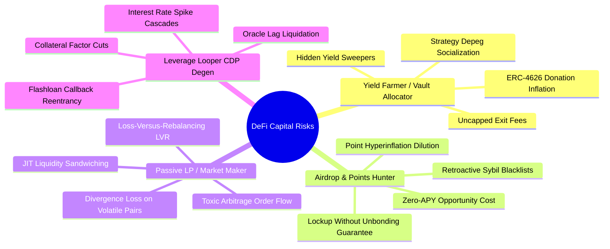
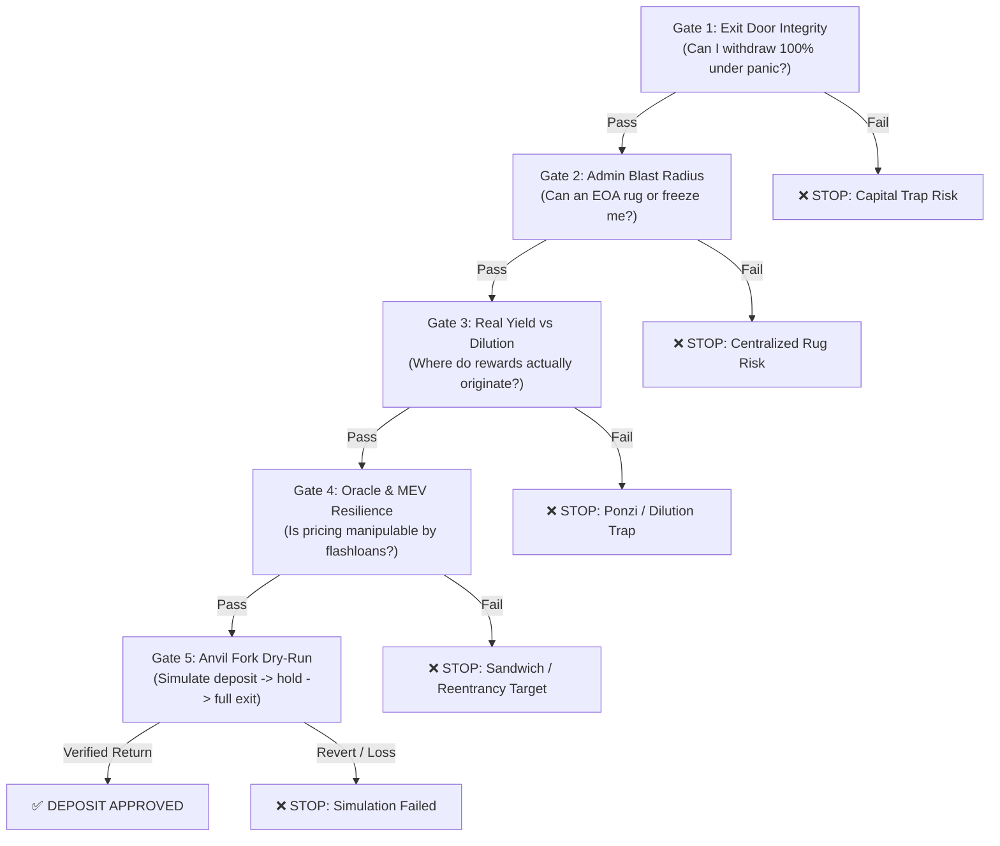

# Institutional Allocator & Pre-Deposit Risk Reference (Perspective B)

Operational manual for evaluating capital preservation, exit mechanics, and economic attack surfaces for **Perspective B (The Tactical Allocator / Risk Lead)**.

---

## 🧭 The Core Mindset: Code Auditor vs. Capital Allocator

| Metric | Traditional Code Review (Developer/Compiler Focus) | Institutional Allocator (Perspective B) |
| :--- | :--- | :--- |
| **Primary Objective** | Identify AST bugs, syntax flaws, compiler warnings | **Protect principal capital from being rugged, diluted, or trapped** |
| **Primary Scope** | Line-by-line coverage, unit tests, code style | **Exit doors, admin keys, share pricing, oracles, strategy routing** |
| **Read-Only Functions** | Often filtered out as non-mutating | **Critical** (oracle spot queries, share price manipulation, reentrancy) |
| **Key Output Metric** | CVSS finding count, code remediation diffs | **Max Safe Capacity ($C_0$), Physical Liquidity Ratio ($\mu$), Binary Verdict** |

---

## 👥 4 Core Investor Archetypes & Vulnerability Surfaces



### 1. Yield Farmer / Vault Allocator
* **Objective**: Allocate stable assets (USDC, USDT, ETH) into automated yield vaults (ERC-4626, Morpho, Yearn, Beefy).
* **Capital Loss Surface**:
  1. **Empty Vault Donation Inflation**: Early depositor deposits 1 wei, donates $10,000 to vault, inflating share price. Next depositor depositing $15,000 receives 1 share; attacker redeems and steals $2,500. *(Mitigation: OpenZeppelin virtual shares/assets offset $\ge 3$)*.
  2. **Strategy Depeg Socialization**: Vault routes assets into secondary yield venues. One venue incurs bad debt; the vault socializes the loss across all depositors or halts withdrawals.
  3. **Stealth Fee Hikes**: `setPerformanceFee()` or `setWithdrawalFee()` lacks an immutable ceiling and is called immediately before users exit.

### 2. Airdrop & Points Hunter
* **Objective**: Lock capital to accumulate points or multipliers for an anticipated token airdrop.
* **Capital Loss Surface**:
  1. **Point Dilution Velocity**: Total points supply is uncapped; team triples weekly emissions near season end, reducing per-point value by 70%.
  2. **Retroactive Sybil / Blacklist Clauses**: The deposit contract or off-chain API includes blacklisting functions (`isBlacklisted[user]`), allowing the team to disqualify large farmers arbitrarily.
  3. **Lockup Without Redemption Guarantees**: Assets locked in bridge or escrow contracts where withdrawal depends on an unreleased protocol upgrade.

### 3. Passive Liquidity Provider (LP)
* **Objective**: Provide liquidity on AMMs (Uniswap v3/v4, Curve, Aerodrome) to earn swap fees and incentives.
* **Capital Loss Surface**:
  1. **LVR (Loss-Versus-Rebalancing)**: Arbitrageurs execute trades against stale AMM quotes when CEX prices move, systematically extracting value from LPs.
  2. **JIT (Just-In-Time) Liquidity Attacks**: MEV bots add liquidity immediately before a large swap and withdraw it immediately after, capturing 99% of pool fees and leaving passive LPs with only toxic flow.
  3. **Fee-on-Transfer / Non-Standard Tokens**: Token pairs that deduct fees on transfer (e.g. PAXG, tax tokens) corrupt constant-product math ($k = x \cdot y$), resulting in drainable pool reserves.

### 4. Leverage Looper (CDP & Money Market Degen)
* **Objective**: Loop collateral (e.g. deposit stETH $\to$ borrow ETH $\to$ stake stETH $\to$ repeat 5x) for leveraged staking yield.
* **Capital Loss Surface**:
  1. **Stale Oracle Lead-Lag Arbitrage**: Secondary market depeg occurs while Chainlink feed remains at parity; liquidators frontrun oracle updates to liquidate positions.
  2. **Variable Borrow Rate Spikes**: Utilization hits 100%, borrow APR jumps from 3% to 85%, rapidly draining equity.

---

## 🛡️ The 5 Pre-Capital Allocation Gates



### Gate 1: Exit Door Integrity (The Roach Motel Test)
* **Question**: *"If the protocol loses 20% or market crashes, can I withdraw principal immediately?"*
* **Verification Checks**:
  1. **Pause Mechanics**: Search for `whenNotPaused` on `withdraw()` or `redeem()`. Red flag: Deposits enabled, but withdrawals can be unilaterally paused.
  2. **Withdrawal Queue & Timelocks**: Are there unbonding delays (e.g. 7 days)? Is there an epoch-based redemption queue where whales can frontrun retail exits?
  3. **Exit Fees**: Does `withdraw()` charge a fee? Is the fee hard-capped in the contract (`require(fee <= MAX_FEE)`) or can the owner set it to 99%?
  4. **Emergency Egress**: Is there an `emergencyWithdraw()` function, and does it return the underlying asset directly without relying on external yield adapters?
```bash
# Verify pause status and fee caps on-chain
cast call <VAULT_ADDR> "paused()(bool)" --rpc-url $RPC_URL
cast call <VAULT_ADDR> "withdrawalFee()(uint256)" --rpc-url $RPC_URL
```

### Gate 2: Admin Blast Radius & Upgradeability
* **Question**: *"Does any single entity have the power to siphon TVL, mint infinite shares, or upgrade the code to malicious bytecode?"*
* **Verification Checks**:
  1. **Proxy Implementation & Timelock**: Check EIP-1967 implementation slot (`0x36089...`). Admin must be a multisig with a minimum 48h timelock (`minDelay >= 172800`).
  2. **Privileged Siphoning Backdoors**: Check for `sweep()`, `recoverERC20()`, or `migrate()` that can drain underlying tokens.
```bash
cast storage <VAULT_ADDR> 0x360894a13ba1a3210667c828492db98dca3e2076cc3735a920a3ca505d382bbc --rpc-url $RPC_URL
```

### Gate 3: Real Yield vs. Dilution
* **Question**: *"Is yield paid from real revenue (borrow interest, swap fees), or is it token inflation / uncollateralized looping?"*
* **Verification Checks**:
  1. Check token emission rate vs. protocol fee earnings.
  2. Confirm whether yield requires continuous token staking or if early depositors can extract before lockups unlock.

### Gate 4: Oracle & MEV Resilience
* **Question**: *"Can an MEV searcher borrow $50M on Aave, dump into this pool, and drain my deposit?"*
* **Verification Checks**:
  1. **Spot vs. TWAP**: Does the vault calculate asset value using `balanceOf(address(this))` or Uniswap `slot0()`?
  2. **Read-Only Reentrancy**: Does it query LP virtual prices (e.g. `get_virtual_price()`) during liquidity removal callbacks?
  3. **Slippage Tolerances**: Does harvest/rebalance accept `amountOutMin = 0`?

### Gate 5: Anvil Fork Dry-Run Simulation
Always simulate the complete deposit-to-redemption lifecycle in an isolated Foundry Anvil fork:

```bash
# 1. Spin up an Anvil fork at current block
anvil --fork-url $RPC_URL --fork-block-number $(cast block-number --rpc-url $RPC_URL) &

# 2. Impersonate a whale and fund test address
cast rpc anvil_impersonateAccount <WHALE_ADDR> --rpc-url http://127.0.0.1:8545
cast send <TOKEN_ADDR> "transfer(address,uint256)" <MY_TEST_ADDR> 100000000000000000000000 --from <WHALE_ADDR> --unlocked --rpc-url http://127.0.0.1:8545

# 3. Simulate Approval & Deposit
cast send <TOKEN_ADDR> "approve(address,uint256)" <VAULT_ADDR> 100000000000000000000000 --from <MY_TEST_ADDR> --unlocked --rpc-url http://127.0.0.1:8545
cast send <VAULT_ADDR> "deposit(uint256,address)(uint256)" 100000000000000000000000 <MY_TEST_ADDR> --from <MY_TEST_ADDR> --unlocked --rpc-url http://127.0.0.1:8545

# 4. Fast forward time 7 days & mine blocks
cast rpc anvil_increaseTime 604800 --rpc-url http://127.0.0.1:8545
cast rpc anvil_mine 1000 --rpc-url http://127.0.0.1:8545

# 5. Simulate Full Redemption
cast send <VAULT_ADDR> "redeem(uint256,address,address)(uint256)" <SHARES_BALANCE> <MY_TEST_ADDR> <MY_TEST_ADDR> --from <MY_TEST_ADDR> --unlocked --rpc-url http://127.0.0.1:8545

# 6. Verify Return: Check if redeemed tokens >= initial deposit
cast call <TOKEN_ADDR> "balanceOf(address)(uint256)" <MY_TEST_ADDR> --rpc-url http://127.0.0.1:8545
```

---

## 🚩 The 5 Allocator Kill-Switches (Instant Disqualification)

1. **Unconstrained Withdrawal Fee**: `setFee()` without an immutable `MAX_FEE` limit $\to$ Admin can raise fee to 99% upon panic exit.
2. **Instant Upgradeable Proxy by EOA**: Admin slot points to an unverified private key with 0 timelock delay $\to$ Bytecode can be replaced with a token drainer.
3. **Spot Price Oracle Dependence**: Contract uses `UniswapV2Pair.getReserves()` or `UniswapV3Pool.slot0()` directly for collateral or share valuation $\to$ Guaranteed flashloan drain.
4. **Asymmetric Pause**: Function `pause()` disables `withdraw()` / `redeem()` but allows `deposit()` to continue accepting user funds.
5. **No Virtual Shares on New Vault**: Empty ERC-4626 vault with no first-deposit donation protection $\to$ First depositor will steal subsequent deposits via 1-wei share rounding.
