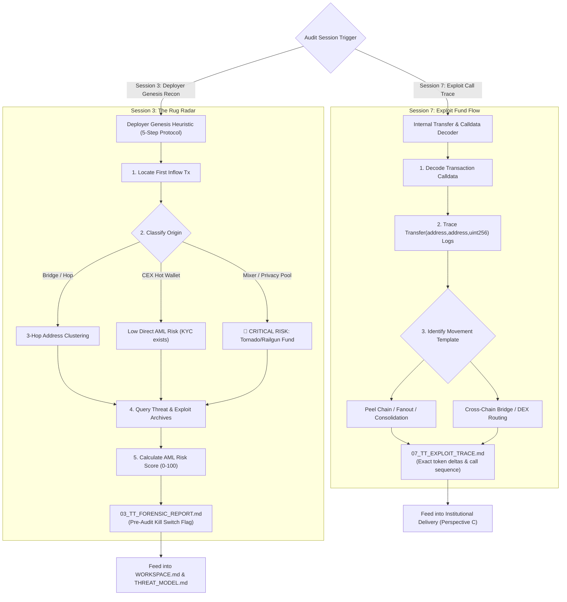

<!-- argument-hint: [target deployer address, tx hash, or investigation topic] -->

# Crypto Asset Tracing & Deployer Forensics (`transaction-tracer`)

**Standard**: Cryptographic Asset Tracing Standard | AML 3-Hop Truncation | Calldata & Internal Transfer Reconstruction  
**Role in Suite**: Executes **Session 3 (Deployer Genesis & Counterparty Forensics)** and **Session 7 (Adversarial Exploit Trace Reconstruction)** in [`invariant-auditor`](../README.md).

---

## 🧭 Visual Operational Workflow



---

## 🔬 How to Use This Skill

### ⚡ Automated CLI Execution Engine (`audit_tracer.py`)
Run the automated on-chain tracer to immediately execute Milestone 1.5 or 4.5:
```bash
# Automated Milestone 1.5: Deployer Genesis & AML Risk Radar
python3 scripts/audit_tracer.py <TARGET_CONTRACT_OR_DEPLOYER> --chain eth --output FORENSIC_REPORT.md
```

- **Without arguments** — Load core tracing frameworks, address categorization, and fund flow heuristics.
- **Milestone 1.5 (With target address / deployer)** — Execute `audit_tracer.py` to perform Genesis Funding Tracing, identify peel chains/mixers, calculate AML Risk Score, and output `FORENSIC_REPORT.md`.
- **Milestone 4.5 (With transaction hash / Foundry trace)** — Decode calldata, trace internal token transfers, analyze bridge/DEX swap hops, and map out-degree fans in `EXPLOIT_TRACE.md`.
- **Deep Reference Chapters** — Consult `chapters/ch01` through `ch06` for deep dives into specific chains (EVM, Tron, Solana, UTXO) and privacy tools (Tornado Cash, Wasabi).

---

## 🧭 Core Frameworks & Mental Models

### 1. The 7 Canonical Fund Movement Patterns
Attackers, scammers, and malicious deployers follow predictable transfer templates:

1. **Peel Chain**: Large sums broken down through a sequential chain of transactions where each hop peels off a small amount (e.g. for gas or split payments) while forwarding the main balance to a fresh address.
2. **One-to-Many Fanout (Distribution)**: Splitting a large balance into dozens/hundreds of intermediary addresses to delay freezing, evade threshold alerts, and obscure the origin.
3. **Many-to-One Consolidation**: Gathering stolen or farmed funds from multiple bot/farm wallets into a single core address before bridging, mixing, or cashing out (common in rug pulls).
4. **Multi-Hop Relays**: Rapid, single-use intermediary hops without interacting with any dApps, designed to defeat shallow graph depth limits.
5. **Mixer Infiltration / Exfiltration**: Depositing standardized denominations (e.g. 0.1, 1, 10, 100 ETH) into pools (Tornado Cash, Railgun, Wasabi) to break graph connectivity.
6. **Cross-Chain Bridge Hops**: Moving assets across chains (THORChain, Stargate, Across, Wormhole) into less monitored networks (e.g. Tron) or privacy-preserving environments.
7. **P2P / OTC / Non-KYC Off-ramps**: Converting assets off-chain via OTC brokers, Telegram escrow, or lightly regulated regional exchanges.

---

### 2. Milestone 1.5: Deployer Genesis Funding Heuristic (5-Step Protocol)

When evaluating a smart contract deployer or administrator address:

```
[Target Deployer Address]
         │
         ▼
[Step 1: Locate Genesis Tx] ──► Find the first incoming native token (ETH/SOL/TRX) tx
         │
         ▼
[Step 2: Trace Genesis Funding Source]
         ├─► A: Direct from CEX (Binance, OKX, Coinbase, Kraken) -> Low Direct Risk (KYC exists)
         ├─► B: Direct from Mixer (Tornado Cash, Railgun) -> 🚨 CRITICAL RISK / Malicious Anonymity
         ├─► C: From Intermediary EOA (Multi-hop) -> Apply 3-Hop Tracing
         └─► D: From Bridge (Stargate, Across, Wormhole) -> Identify Origin Chain & Sender
         │
         ▼
[Step 3: Cluster Associated Deployments] ──► Identify other contracts deployed by the same EOA or funding cluster
         │
         ▼
[Step 4: Check Known Malicious Archives] ──► Query Public Exploit & Threat Databases
         │
         ▼
[Step 5: Synthesize Risk Rating] ──► Output FORENSIC_REPORT.md with 0-100 AML Risk Score
```

### The Pre-Audit Kill Switch Rule:
> [!CAUTION]
> If `FORENSIC_REPORT.md` assigns an **AML Risk Score $\ge 80$** (e.g. Genesis gas funded directly from Tornado Cash $< 72\text{ hours}$ before deployment, or deployer clustered with a known honeypot/rug address), the audit engine issues an immediate **CRITICAL COUNTERPARTY KILL-SWITCH ALERT** in `WORKSPACE.md`. Allocators and audit teams can halt work before incurring further costs.

---

### 3. Milestone 4.5: Exploit Fund Flow & Call Trace Reconstruction

When an exploit finding is verified via [`poc-engine`](../poc-engine/SKILL.md) or when analyzing an active mainnet incident:

1. **Transaction Calldata Decoding**:
   Extract entrypoint selector, decoded parameter arguments, and external delegate calls.
2. **Internal Transfer Log Parsing**:
   Filter all `Transfer(address from, address to, uint256 value)` events to establish net token balance changes for all involved contracts and the exploiter.
3. **Routing Hop Mapping**:
   Map whether extracted collateral was routed through Uniswap/Curve pools, bridged across Layer 2s, or deposited into privacy pools.
4. **Artifact Generation**:
   Compile the formal `EXPLOIT_TRACE.md` for Perspective C (Adversarial Operator) and executive review.

---

## 🗂️ Chapter Index & Deep Reference Manuals

| # | Chapter File | Topics Covered |
|---|---|---|
| **ch01** | [`chapters/ch01-core-concepts-and-explorers.md`](chapters/ch01-core-concepts-and-explorers.md) | Address taxonomy (Hot, Cold, Deposit, Contract, Multi-sig), UTXO change vs Account model, Explorers. |
| **ch02** | [`chapters/ch02-fund-movement-patterns.md`](chapters/ch02-fund-movement-patterns.md) | Peel chain mechanics, One-to-Many, Many-to-One consolidation, Multi-hop detection algorithms. |
| **ch03** | [`chapters/ch03-mixers-and-privacy-tools.md`](chapters/ch03-mixers-and-privacy-tools.md) | Tornado Cash deposit/withdrawal timing analysis, Wasabi CoinJoin, Railgun anonymity sets. |
| **ch04** | [`chapters/ch04-cross-chain-and-bridges.md`](chapters/ch04-cross-chain-and-bridges.md) | Bridge tracking (Stargate, THORChain, Across), Layer 2 to L1 correlation, Tron USDT corridors. |
| **ch05** | [`chapters/ch05-address-clustering-and-profiling.md`](chapters/ch05-address-clustering-and-profiling.md) | Behavior profiling, Gas price fingerprinting, Active time window analysis, Entity tagging. |
| **ch06** | [`chapters/ch06-deployer-forensic-investigation.md`](chapters/ch06-deployer-forensic-investigation.md) | End-to-end deployer verification playbook, Genesis funding risk scoring, `FORENSIC_REPORT.md` schema. |

---

## 📌 Supporting Toolkits & Cheatsheets

- [`cheatsheet.md`](cheatsheet.md) — Genesis funding risk matrix, AML decision rules, 3-Hop truncation protocol.
- [`patterns.md`](patterns.md) — Concrete CLI commands, RPC inspect queries, and multi-chain heuristics.
- [`glossary.md`](glossary.md) — Definitions for 40+ on-chain tracing terms.

---

## 🛡️ Operational Constraints & Invariants

1. **3-Hop Truncation Rule**: Never traverse automated EOA-to-EOA graph connections beyond 3 hops to prevent rate-limit crashes and combinatorial graph explosion. Tag depth-3 endpoints as `UNRESOLVED_HOP`.
2. **Never Confuse Deposit Addresses with Personal EOAs**: Centralized exchange deposit addresses aggregate funds from multiple distinct users; never assume transactions out of a CEX hot wallet share single-entity ownership.
3. **Preserve Exact Hashes and Timestamps**: Every claim of suspicious connection in `FORENSIC_REPORT.md` or `EXPLOIT_TRACE.md` must cite exact transaction hashes, block numbers, and timestamp UTC.
