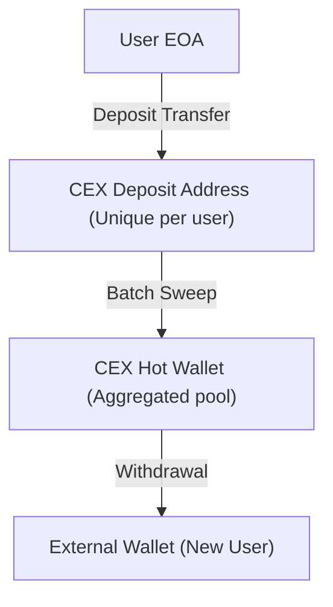

# Chapter 1: Core Concepts & Blockchain Explorers

## Core Idea
Blockchain explorers provide the primary magnifying glass for on-chain intelligence. Tracing requires distinguishing between address types (Deposit vs. Personal EOA vs. Contract), understanding the UTXO change mechanism, and decoding contract Input Data and Event Logs.



## Address Taxonomy & Structural Visuals

1. **CEX Deposit Address**:
   - **Pattern**: Receives periodic inbound transfers from 1 or a few addresses; regularly swept in batch transactions into a known exchange Hot Wallet (e.g. Binance 14, OKX Hot Wallet).
   - **Critical Rule**: Never cluster incoming senders to a deposit address as the same entity.
2. **Cold Storage Vault**:
   - **Pattern**: Infrequent transactions (months/years apart), massive balance accumulations, multi-sig governance.
3. **Contract Accounts (Singleton vs Proxy)**:
   - Identified by lack of private key, presence of bytecode, and execution via internal transactions.

## UTXO Change vs. Account Model

```
[UTXO Transaction: 1.0 BTC Input]
      │
      ├─► 0.60 BTC ──► Recipient Address (Exact invoice amount)
      ├─► 0.39 BTC ──► Newly Generated Change Address (Returned to sender)
      └─► 0.01 BTC ──► Miner Fee
```

- **Heuristic for Identifying Change in UTXO**:
  1. *Round Value Heuristic*: The clean amount (0.6 BTC) is the payment; the fragmented remainder (0.399812 BTC) is the change.
  2. *Address Type Reuse*: If the input was native SegWit (`bc1q...`), the change address generated by standard wallets will also be `bc1q...`.
  3. *Zero History*: The change output address typically has 0 historical transactions prior to this block.

## Explorer Calldata & Log Decoding

- **Input Data**: Smart contract function parameters. When tracing cross-chain routers or DEX swaps, decode raw hex to extract `receiver`, `recipient`, `dstChainId`, and `minAmountOut`.
- **Event Logs (`Transfer`, `Swap`, `CrossChain`)**: Always inspect logs when a transaction involves aggregators (1inch, Paraswap) to uncover the actual destination tokens and final recipient addresses.
