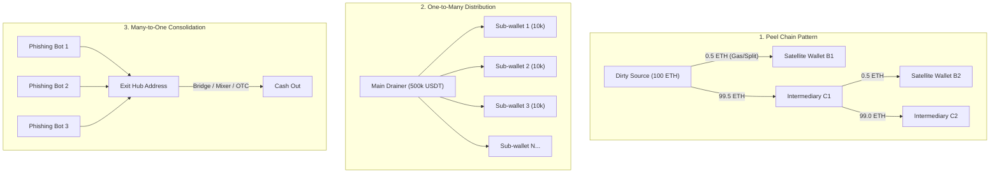

# Chapter 2: Common Fund Movement Patterns

## Core Idea
Attackers and money launderers rely on standardized behavioral templates to break graph connectivity, delay asset freezing, and evade heuristic alert systems.

## Detailed Pattern Mechanics

### 1. Peel Chain (剥皮链)
- **Mechanism**: A high-value source wallet repeatedly transfers a tiny fraction (peel amount, typically 0.1–1.0 ETH or $500–$2,000 USDT) to secondary wallets for local operations while forwarding the bulk remainder to a freshly generated EOA.
- **Investigation Rule**: Always ignore the micro-peel branches during fast triage and follow the **high-balance spine** until the terminal consolidation or mixer deposit.

### 2. One-to-Many Fanout (分散分流)
- **Mechanism**: Immediate disbursement of stolen funds into 20–100 intermediary wallets within minutes of the exploit.
- **Objective**: Prevents issuers (Tether, Circle) from freezing the entire sum in a single contract freeze call; forces compliance teams to submit dozens of individual freeze requests.

### 3. Many-to-One Consolidation (资金归集)
- **Mechanism**: Dozens of phishing or automated draining bots funnel collected tokens into a central staging wallet prior to large-scale DEX swaps or cross-chain bridging.
- **Timing**: Often indicates that an active campaign is winding down or preparing for immediate capital exit.

### 4. Multi-Hop Relays (多跳跳转)
- **Mechanism**: Funds pass through 3–7 single-use EOAs with 0 seconds to 2 minutes between hops.
- **Identification**: Wallets have `txCount <= 2` (one incoming, one outgoing) and 0 dApp interactions.

### 5. P2P & Gray-Market OTC Off-Ramps (场外交易与担保平台)
- **Mechanism**: Bypassing regulated CEX off-ramps by trading on Telegram OTC desks, P2P escrow (e.g. Huione Guarantee in Southeast Asia), or converting to privacy coins (XMR) on non-KYC instant swap services (FixedFloat, ChangeNOW, SideShift).
