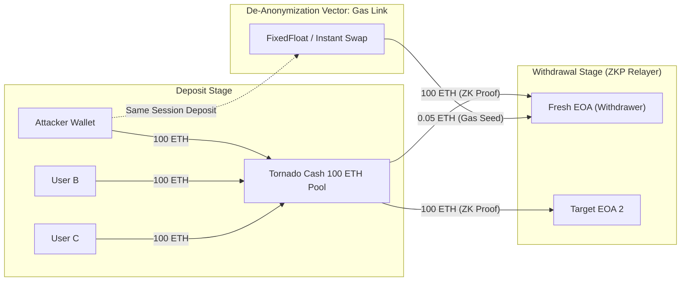

# Chapter 3: Mixers & Privacy Tools Analysis

## Core Idea
Mixers break deterministic on-chain linkability by pooling deposits into standardized denomination smart contracts and allowing withdrawals via zero-knowledge proofs. However, operational security mistakes by attackers (gas funding, timing correlation, recipient reuse) frequently allow partial or complete de-anonymization.

## Tornado Cash Analysis Framework

### 1. Standard Pool Denominations
Tornado Cash on Ethereum mainnet operates in fixed pools:
- **ETH Pools**: `0.1 ETH`, `1 ETH`, `10 ETH`, `100 ETH`.
- **DAI / USDT / USDC Pools**: `100`, `1,000`, `10,000`, `100,000` tokens.
- **Attacker Batching Signature**: When an attacker steals e.g. 2,450 ETH, they deposit in exact multiples: `24 x 100 ETH` + `5 x 10 ETH`.

### 2. The 3 Breakthrough Vectors for Mixer De-anonymization

1. **Gas Fee Source Correlation (The "FixedFloat / SideShift Link")**:
   - Withdrawals from Tornado Cash to a brand-new address require gas to conduct subsequent swaps or transfers.
   - If the attacker uses an instant swap service (e.g. FixedFloat, ChangeNOW) to fund the gas wallet, check the deposit timestamp and deposit asset on the instant swap service.
2. **Time-Window & Denomination Clustering**:
   - If 24 x 100 ETH is deposited over 2 hours, and a specific cluster of fresh addresses withdraws 24 x 100 ETH over the next 48 hours with identical gas settings and transfers to the same DEX or lending protocol, the probability of shared ownership approaches 99%.
3. **Downstream Consolidation / Interaction Overlap**:
   - Attackers frequently withdraw to distinct addresses but subsequently interact with the same custom smart contract, transfer to the same NFT marketplace, or send residual change to a shared deposit wallet.

---

## Wasabi CoinJoin & UTXO Mixing Analysis

- **Equal Output Rule**: In a Wasabi CoinJoin transaction, all mixed outputs have identical satoshi amounts (e.g. `0.10000000 BTC`).
- **Toxic Change (Unmixed Remainder)**: The leftover satoshis that did not fit into the standard denomination are returned as "unmixed change". If the user later merges this change with other UTXOs, the privacy set collapses.
